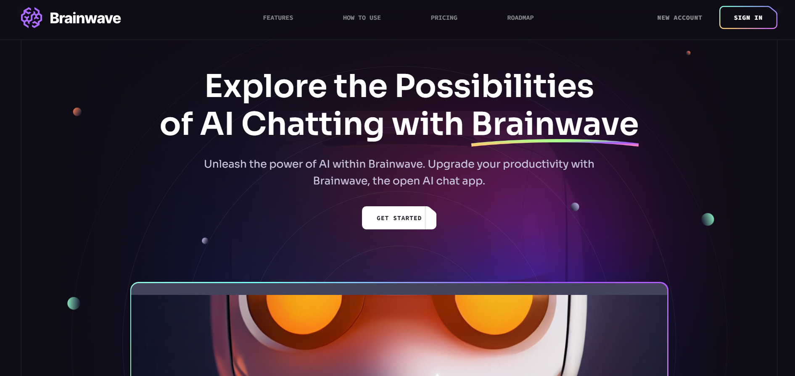

# <h1 style="text-align: center;">🌟 BrainWave AI Website 🚀</h1>

    

## [SEE LIVE🌟](https://brainwave-stardust.vercel.app/)

Welcome to Brain Wave, an innovative AI website built using React and Tailwind CSS! Let's dive into the future together! 🌈

<h2 style="text-align: ;">✨ Features</h2>

<ul style="list-style-type: none; text-align: ;">
    <li>🌟 Stunning Parallax Effects: Utilize the "react-just-parallax" library to create captivating parallax effects that engage your users.</li>
    <li>🔗 Seamless Navigation: With "react-router-dom," users can seamlessly navigate between different sections of your website, ensuring a smooth browsing experience.</li>
    <li>🔒 Scroll Lock: Ensure a distraction-free experience for your users by implementing "scroll-lock" to prevent unwanted scrolling during interactions.</li>
</ul>

<h2 style="text-align: ;">🛠 Technologies Used</h2>

<ul style="list-style-type: none; text-align: ;">
    <li>React ⚛️</li>
    <li>Tailwind CSS 🎨</li>
    <li>react-just-parallax: ^3.1.16 🌌</li>
    <li>react-router-dom: ^6.22.3 🚪</li>
    <li>scroll-lock: ^2.1.5 🔒</li>
</ul>

<h2 style="text-align: ;">🚀 How to Run</h2>

<ol >
    <li>Clone this repository 🔄</li>
    <li>Navigate to the project directory 📁</li>
    <li>Install dependencies using <code>npm install</code> 📦</li>
    <li>Start the development server with <code>npm start</code> ▶️</li>
    <li>Open your browser and go to <a href="http://localhost:3000">http://localhost:3000</a> to view the website 🌐</li>
</ol>

 <h2>🔮 Future Goals</h2>
        
Our future roadmap includes:

        <ul>
            <li>🔹 Transitioning from React to Next.js for improved performance and SEO.</li>
            <li>🔹 Integrating advanced AI features such as image generation and chat functionalities for enhanced user interaction. 🖼️💬</li>
            <li>🔹 Expanding our reach and impact in the AI community through innovative projects and collaborations. 🌐</li>
        </ul>

<h2 style="text-align: ;">🤝 Contributing</h2>

Contributions are welcome! If you'd like to contribute to Brain Wave, please follow these steps:

<ol >
    <li>Fork the repository 🍴</li>
    <li>Create your feature branch (<code>git checkout -b feature/AmazingFeature</code>) 🌟</li>
    <li>Commit your changes (<code>git commit -m 'Add some amazing feature'</code>) 💡</li>
    <li>Push to the branch (<code>git push origin feature/AmazingFeature</code>) 🚀</li>
</ol>

###### This project is inspired by the [BrainWave AI Landing Page Kit](https://ui8.net/ui8/products/brainwave-ai-landing-page-kit?rel=jsm) available on UI8. Check it out for more design inspiration! ✨

 <h3 style="text-align: center; font-style: italic;">"The only way to do great work is to love what you do." - Steve Jobs 🌟</h3>

 

